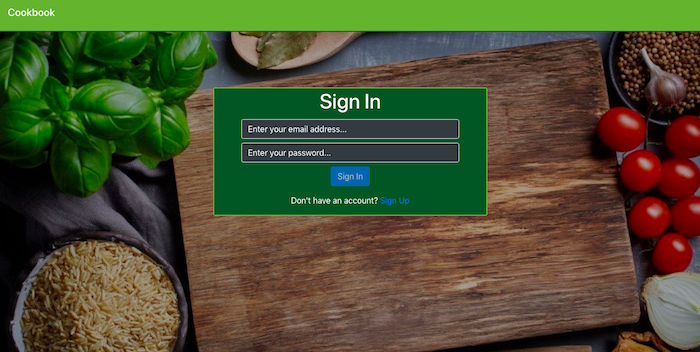

# Cookbook
React CRUD app where users can store and easily retrieve their favorite recipes without the bells and whistles

**Deployed:** [Cookbook](https://cookbook-react-62ffa.firebaseapp.com/)

## Demo

**Add New Recipe Part 1:**

**Add New Recipe Part 2 / Save Recipe:**

**Edit Recipe:**

**Search / Delete Recipe:**

